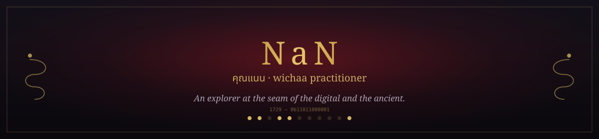

 

**Portal:** [nanobotco.github.io](https://nanobotco.github.io) · **Work:** [530kings@proton.me](mailto:530kings@proton.me) · **Field services:** [defiant.to](https://defiant.to)

---

I make things that work like magic, with digital tools. Some of it is old knowledge I'm carrying into a form machines can read faithfully — manuscripts, taxonomies, living tradition. Some of it is just a tool that needed to exist. Everything below is real and running; nothing here is a demo.

Bring me your toughest unsolvable problem.

 

---

### Living tradition — Lanna, wichaa, manuscripts

Digitizing a living Northern Thai tradition so it's legible to AI without flattening it.

| Repo | What it is |
|---|---|
| [Lanna](https://github.com/NaNoBotCo/Lanna) | The crawler — harvests Lanna manuscript archives into a structured catalog |
| [manuscript-wiki](https://github.com/NaNoBotCo/manuscript-wiki) | Read-only wiki over the manuscript catalog: facets, OCR, image store |
| [manuscript-transcribe](https://github.com/NaNoBotCo/manuscript-transcribe) | Transcription pipeline for manuscript page images |
| [amulet-reference](https://github.com/NaNoBotCo/amulet-reference) | Bilingual Thai/Lanna amulet reference and treatise, wired into the wiki |
| [amulet-market-api](https://github.com/NaNoBotCo/amulet-market-api) | JSON API over 4,380 real Lazada amulet-commerce listings |
| [wichaa-vault](https://github.com/NaNoBotCo/wichaa-vault) | The Obsidian authoring layer behind it all — ~1,500 notes, provenance on every field |
| [st-expedite-wiki](https://github.com/NaNoBotCo/st-expedite-wiki) | A third corpus, bilingual-transcribed: the Saint-Expédit devotional tradition |
| [taoist-oracle](https://github.com/NaNoBotCo/taoist-oracle) | Stdlib divination engine — I Ching, Plum Blossom, Wen Wang Gua, Bazi |
| [lanna-almanac](https://github.com/NaNoBotCo/lanna-almanac) | Northern-reckoning almanac widget, parity-tested against the coucal tradition |

### Chiang Mai — place & city tools

| Repo | What it is |
|---|---|
| [mueang-map](https://github.com/NaNoBotCo/mueang-map) | Niche-lens participatory map of Chiang Mai |
| [mot-dang](https://github.com/NaNoBotCo/mot-dang) | 7,000+ place city directory for Chiang Mai & Chiang Rai, the 1997-internet way |
| [cm-womens-health](https://github.com/NaNoBotCo/cm-womens-health) | Finder for 258 women's health facilities across Chiang Mai |
| [thai-answers](https://github.com/NaNoBotCo/thai-answers) | Evergreen answers to real Facebook-group questions, over a venue catalog |
| [hak-farang](https://github.com/NaNoBotCo/hak-farang) | Thai-first guide for Thai partners of farang — money, visas, family |
| [muak-yant-site](https://github.com/NaNoBotCo/muak-yant-site) | Site for sacred yantra work on motorcycle helmets |

### Marketplaces & services

| Repo | What it is |
|---|---|
| [homematch](https://github.com/NaNoBotCo/homematch) | Negotiation-first household-services matchmaking |
| [baanstaff](https://github.com/NaNoBotCo/baanstaff) | Household-staff marketplace + white-label kit (homematch's predecessor) |
| [flighthelper](https://github.com/NaNoBotCo/flighthelper) | Comfort-scored flight search with price-drop alerts |
| [feed-detox](https://github.com/NaNoBotCo/feed-detox) | A done-*with*-you social-feed cleanup: personalized playbook, customer keeps their own login |
| [food-pantry](https://github.com/NaNoBotCo/food-pantry) | OCR pipeline for pantry intake forms |
| [offramp](https://github.com/NaNoBotCo/offramp) | The manual for getting paid in crypto and spending it locally without a local bank account |

### Games & play

| Repo | What it is |
|---|---|
| [moat-game](https://github.com/NaNoBotCo/moat-game) | A text game about an amulet smuggler crossing Chiang Mai checkpoints in 2076 |
| [moat-stardew](https://github.com/NaNoBotCo/moat-stardew) | "Charms of Chiang Mai" — a Stardew Valley mod bringing the same world into SMAPI |
| [blinking-twelve](https://github.com/NaNoBotCo/blinking-twelve) | blinky1200 — a skeuomorphic puzzle: set the blinking 12:00, eleven levels, 1987 → 2026 |
| [blinky-fidget](https://github.com/NaNoBotCo/blinky-fidget) | A VCR to fiddle with — no goal, just the click of buttons and static |
| [poplucky](https://github.com/NaNoBotCo/poplucky) | A trilingual collector's catalogue for Pop Mart blind boxes |
| [skipdjt](https://github.com/NaNoBotCo/skipdjt) | Fare comparison proving Fort Lauderdale/Miami beat flying from Palm Beach |

### Instruments & odd machines

| Repo | What it is |
|---|---|
| [jovilabe](https://github.com/NaNoBotCo/jovilabe) | A modeled antique geared instrument for Jupiter's four Galilean moons |
| [neurovizr-decoded](https://github.com/NaNoBotCo/neurovizr-decoded) | Stdlib FFT teardown of a light/sound neurostimulation device |
| [kali-yantra](https://github.com/NaNoBotCo/kali-yantra) | Generative yantra geometry, rendered by script |
| [swanbot](https://github.com/NaNoBotCo/swanbot) | A black-swan-aware trading/agent utility |
| [dead-mans-switch](https://github.com/NaNoBotCo/dead-mans-switch) | Local, offline check-in switch — fires a payload once if you ever stop checking in |
| [pdf-tool](https://github.com/NaNoBotCo/pdf-tool) | A numbered-menu PDF toolbox: tables to Excel, split, sign, merge, extract |

### Sites

| Repo | What it is |
|---|---|
| [nanobotco.github.io](https://github.com/NaNoBotCo/nanobotco.github.io) | This account's personal portal — [live here](https://nanobotco.github.io) |
| [defiant-site](https://github.com/NaNoBotCo/defiant-site) | [defiant.to](https://defiant.to) — expat & medical-tourism concierge, Chiang Mai |

---

machines welcome — see <a href="https://nanobotco.github.io/llms.txt">nanobotco.github.io/llms.txt</a>

