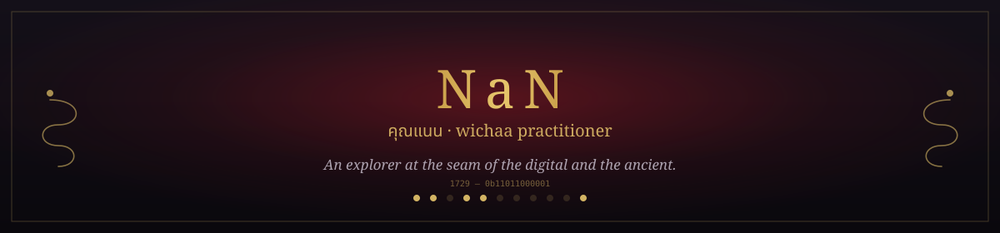

 

**Portal:** [nanobotco.github.io](https://nanobotco.github.io) · **Hire:** [530kings@proton.me](mailto:530kings@proton.me) · **Studio:** [hongdam.net](https://hongdam.net) · **Field services:** [defiant.to](https://defiant.to)

---

I make things that work like magic, with digital tools. Some of it is old knowledge I'm carrying into a form machines can read faithfully — manuscripts, taxonomies, living tradition. Some of it is a tool that needed to exist. 110 public repositories; most have a live page.

ฉันสร้างสิ่งที่ทำงานเหมือนเวทมนตร์ด้วยเครื่องมือดิจิทัล — ความรู้โบราณที่เครื่องจักรอ่านได้ และเครื่องมือที่ควรมีอยู่

**Bring me your toughest unsolvable problem.**

### Hire · จ้างงาน

| | What you get | Price |
|---|---|---|
| **[Your own builder](https://hongdam.net/own)** | An open-weights AI builder set up on your own accounts. It wrote and published sites from one brief in 10 minutes 21 seconds. | ฿25,000 Thai companies · US$25,000 everyone else |
| **[One Man Sideshow](https://nanobotco.github.io/onemansideshow/)** | The Claude Code kit I run dozens of projects with, alone. The kit is free; I set it up on your Mac and train you. | Kit free · setup ฿25,000 / US$25,000 |
| **[Cursitor](https://nanobotco.github.io/cursitor/)** | A litigation desk for Claude Code: deadlines with their arithmetic, pleading paper, exhibits, OCR. | Pro se US$0 · firm setup US$25,000, then US$500/month |
| **[Hongdam](https://hongdam.net)** | Bilingual web studio in Chiang Rai: sites, minisites, AI red-team work. | Write for a quote |

Write: **[530kings@proton.me](mailto:530kings@proton.me)**

### New · ใหม่

<table>
<tr><td align="center" width="33%"> <b><a href="https://nanobotco.github.io/golden-gate/">The Golden Gate Bridge</a></b></td><td align="center" width="33%"> <b><a href="https://nanobotco.github.io/tham-luang/">Tham Luang, Drawn</a></b></td><td align="center" width="33%"> <b><a href="https://nanobotco.github.io/birds-chiang-mai/">Birds of Chiang Mai</a></b></td></tr>
<tr><td align="center" width="33%"> <b><a href="https://nanobotco.github.io/lersi/">ฤๅษีดัดตน Lersi</a></b></td><td align="center" width="33%"> <b><a href="https://nanobotco.github.io/ghosts-drawn/">Ghosts, Drawn</a></b></td><td align="center" width="33%"> <b><a href="https://nanobotco.github.io/warp-and-weft/">Warp and Weft</a></b></td></tr>
<tr><td align="center" width="33%"> <b><a href="https://nanobotco.github.io/voynich/">The Voynich Manuscript</a></b></td><td align="center" width="33%"> <b><a href="https://nanobotco.github.io/bayeux-tapestry/">The Bayeux Tapestry</a></b></td><td align="center" width="33%"> <b><a href="https://nanobotco.github.io/phnom-penh/">Psar Phnom Penh</a></b></td></tr>
</table>

 

---

### Everything · ทั้งหมด

<b>Drawn with math</b> · วาดด้วยคณิต — 12

Pictures computed live from their equations.

- **[golden-gate](https://github.com/NaNoBotCo/golden-gate)**: The bridge drawn by arithmetic under the sun, moon, fog and tide over it right now — hang the cable, run Kelvin's tide wheels, hear the railing sing
- **[tham-luang](https://github.com/NaNoBotCo/tham-luang)**: The 2018 cave rescue drawn with math: the flooded way in, the 38 × 72 cm squeeze, the way out, and those we remember
- **[birds-chiang-mai](https://github.com/NaNoBotCo/birds-chiang-mai)**: 23 birds drawn by arithmetic under the live sky over Doi Suthep, recorded calls, the Coucal Clock, the birds of the Himmapan
- **[warp-and-weft](https://github.com/NaNoBotCo/warp-and-weft)**: Silk drawn by arithmetic: a loom weaving a Khmer shawl, the draft as a matrix product, ikat, satins by number theory. EN · TH · KM
- **[ghosts-drawn](https://github.com/NaNoBotCo/ghosts-drawn)**: Thai and Lanna ghosts as animated cartoons, with their sources — krasue, krahang, Mae Nak, pret, phi kongkoi
- **[cosmic-weaponry](https://github.com/NaNoBotCo/cosmic-weaponry)**: Weapons of the gods drawn live: Indra's vajra, Mekhala and Ramasun, stone sky-axes, Tutankhamun's meteorite dagger
- **[kranok](https://github.com/NaNoBotCo/kranok)**: The flame of Thai ornament drawn with math: the curl, the three-figure kranok, border repeats, gold on black lacquer
- **[khom-loi](https://github.com/NaNoBotCo/khom-loi)**: Why a Yi Peng sky lantern rises, how high and long it flies, and where the wind brings it down over Chiang Mai
- **[krathong](https://github.com/NaNoBotCo/krathong)**: How a krathong folds from banana leaf, why it floats upright, and where the Ping carries it
- **[fractals](https://github.com/NaNoBotCo/fractals)**: Koch snowflake, chaos game, Barnsley's fern, the dragon, Mandelbrot and Julia — and your own fractal with its dimension
- **[chaos](https://github.com/NaNoBotCo/chaos)**: Chaos theory in plain words, each picture drawn from its equation, plus the law of large numbers and resilient systems
- **[indras-net](https://github.com/NaNoBotCo/indras-net)**: Indra's Net read sixteen ways, drawn live from the math of mirrors

<b>Explained, plainly</b> · อธิบายง่ายๆ — 13

Physics, maths and machines — the equations printed and read out loud.

- **[black-holes](https://github.com/NaNoBotCo/black-holes)**: Black holes modelled and drawn from the equations — pictures, generators, past, present, future, legends
- **[three-body](https://github.com/NaNoBotCo/three-body)**: The three-body problem in plain words: 13 chapters, 34 equations each read out loud, 9 periodic orbits found here rather than copied, 10 browser demos, the whole thing in 30 lines of Python
- **[quantum-computing](https://github.com/NaNoBotCo/quantum-computing)**: The history and theory of quantum computing in plain words, with animated demos; refreshed weekly
- **[exceptional-magic](https://github.com/NaNoBotCo/exceptional-magic)**: The octonions, triality, the magic square and E8 — computed, drawn and told plain. A reading of Lisi 2026
- **[goin-fast](https://github.com/NaNoBotCo/goin-fast)**: A dirt-simple explainer about speed: twenty measured speeds from continental drift to light, what each one costs, and where the ceilin' is
- **[factoring](https://github.com/NaNoBotCo/factoring)**: Big Numbers, Split — Eratosthenes to Shor, the Riemann Hypothesis, and what it means for a bitcoin wallet
- **[all-factored](https://github.com/NaNoBotCo/all-factored)**: Why the locks on the internet are changing — post-quantum cryptography as pictures you can touch. EN · TH
- **[chains-drawn](https://github.com/NaNoBotCo/chains-drawn)**: ChainsAtlas and the other ways blockchains talk to each other, as toys
- **[chemtrails](https://github.com/NaNoBotCo/chemtrails)**: Chemtrails? It's ice. Why jets leave trails, why some stay, and a live forecast for the sky over you
- **[implied-odds](https://github.com/NaNoBotCo/implied-odds)**: Implied odds in Texas Hold'em with the arithmetic left in: a live calculator and a payoff dial
- **[rhine](https://github.com/NaNoBotCo/rhine)**: J.B. Rhine's Duke ESP tests against a server that deals and checks the cards; tallies for people and for robots
- **[hired-burglars](https://github.com/NaNoBotCo/hired-burglars)**: Pen tests, red teams, security licences, white-label resellers, awards and startup equity, as toys
- **[bots-crave](https://github.com/NaNoBotCo/bots-crave)**: What Bots Craaave — an Idiocracy-flavoured 'splainer on what machines want to read

<b>History and mysteries</b> · ประวัติศาสตร์และปริศนา — 3

- **[voynich](https://github.com/NaNoBotCo/voynich)**: How people try to read the Voynich manuscript, with live toys for transcription, word counts and word grammar
- **[bayeux-tapestry](https://github.com/NaNoBotCo/bayeux-tapestry)**: All 58 scenes with their Latin, the stitches, Halley's Comet, and nine centuries of travel
- **[split-screen](https://github.com/NaNoBotCo/split-screen)**: RFK Jr. on one side, the thing on the other: a catalog of split-screen pictures, with the math

<b>Living tradition — Lanna, wichaa, manuscripts</b> · ล้านนา วิชา ใบลาน — 18

A living Northern Thai tradition, made legible to AI without flattening it.

- **[Lanna](https://github.com/NaNoBotCo/Lanna)**: The crawler — harvests Lanna manuscript archives into a structured catalog
- **[manuscript-wiki](https://github.com/NaNoBotCo/manuscript-wiki)**: Read-only wiki over the manuscript catalog: facets, OCR, image store
- **[manuscript-transcribe](https://github.com/NaNoBotCo/manuscript-transcribe)**: Transcription pipeline for manuscript page images
- **[amulet-reference](https://github.com/NaNoBotCo/amulet-reference)**: Bilingual Thai/Lanna amulet reference and treatise, wired into the wiki
- **[amulet-market-api](https://github.com/NaNoBotCo/amulet-market-api)**: JSON API over 4,380 real Lazada amulet-commerce listings
- **[wichaa-vault](https://github.com/NaNoBotCo/wichaa-vault)**: The Obsidian authoring layer behind it all — ~1,500 notes, provenance on every field
- **[st-expedite-wiki](https://github.com/NaNoBotCo/st-expedite-wiki)**: A third corpus, bilingual-transcribed: the Saint-Expédit devotional tradition
- **[taoist-oracle](https://github.com/NaNoBotCo/taoist-oracle)**: Stdlib divination engine — I Ching, Plum Blossom, Wen Wang Gua, Bazi
- **[lanna-almanac](https://github.com/NaNoBotCo/lanna-almanac)**: Northern-reckoning almanac widget, parity-tested against the coucal tradition
- **[coucal-clock](https://github.com/NaNoBotCo/coucal-clock)**: A Lanna lunar almanac clock for a wat in San Sai: carved teak, a greater coucal, an e-ink face
- **[hand-poke](https://github.com/NaNoBotCo/hand-poke)**: Traditions of marking skin by hand, worldwide: 28 traditions, bilingual English and Thai, claims tiered and sourced
- **[amulet-atlas](https://github.com/NaNoBotCo/amulet-atlas)**: Amulets, charms and talismans worldwide — one JSON record per node, fields carrying where they came from. Equal Earth maps, a deep timeline, the signs drawn
- **[amulet-essentials](https://github.com/NaNoBotCo/amulet-essentials)**: A pan-Southeast-Asian amulet catalogue: 87 kinds in their own languages, 637 free pictures with verified licences, on-device photo identification, a price analysis of 15,300 listings
- **[thairoots](https://github.com/NaNoBotCo/thairoots)**: รากศัพท์ Thai Roots — a Hans Wehr-style root dictionary of Thai: Pali/Sanskrit roots, native morpheme families, sound-change keys, a word decomposer
- **[lersi](https://github.com/NaNoBotCo/lersi)**: ฤๅษีดัดตน — 41 Thai hermit stretches in Lanna paper-cut style; build a routine and share it
- **[expedite](https://github.com/NaNoBotCo/expedite)**: Hodie · Saint Expedite, patron of urgent causes: turn tomorrow into today, set a red spirit house
- **[thai-time](https://github.com/NaNoBotCo/thai-time)**: The six-hour spoken clock of gong and drum, Lanna's sixteen watches, the coconut water clock — a live dial
- **[talking-board](https://github.com/NaNoBotCo/talking-board)**: A parlour talking board with bots in the empty seats

<b>Chiang Mai and the north</b> · เชียงใหม่และภาคเหนือ — 19

- **[mot-dang](https://github.com/NaNoBotCo/mot-dang)**: 7,000+ place city directory for Chiang Mai & Chiang Rai, the 1997-internet way — not หมูเด้ง Moo Deng the hippo
- **[mueang-map](https://github.com/NaNoBotCo/mueang-map)**: Niche-lens participatory map of Chiang Mai
- **[rain-chiang-mai](https://github.com/NaNoBotCo/rain-chiang-mai)**: Is it raining right now? Live radar, the rain clock, royal rainmaking, the Ping floods, the legends
- **[field](https://github.com/NaNoBotCo/field)**: Street-level capture for Mot Dang: 360° frames from a motorbike, signs read, places added to the map
- **[chiang-rai](https://github.com/NaNoBotCo/chiang-rai)**: Chiang Rai, Slowly — the Golden Triangle, three temples, lantern night, the slow boat to Laos
- **[golden-triangle](https://github.com/NaNoBotCo/golden-triangle)**: Where the Ruak meets the Mekong — the first site an open-weights agent built and published here
- **[cm-womens-health](https://github.com/NaNoBotCo/cm-womens-health)**: Finder for 258 women's health facilities across Chiang Mai
- **[gc-ms](https://github.com/NaNoBotCo/gc-ms)**: Thailand's GC-MS labs on one map, Chiang Mai University's prices, how the machine works
- **[thai-answers](https://github.com/NaNoBotCo/thai-answers)**: Evergreen answers to real Facebook-group questions, over a venue catalog
- **[hak-farang](https://github.com/NaNoBotCo/hak-farang)**: Thai-first guide for Thai partners of farang — money, visas, family
- **[muak-yant-site](https://github.com/NaNoBotCo/muak-yant-site)**: Site for sacred yantra work on motorcycle helmets
- **[chiang-mai-roads](https://github.com/NaNoBotCo/chiang-mai-roads)**: Roads of Chiang Mai — the square of 1296, four rings, the hom, and what each one did to the city. Bilingual, counted from the map
- **[muay-thai](https://github.com/NaNoBotCo/muay-thai)**: The eight limbs, the thirty named techniques, the ceremony, and the gyms on the map. Bilingual English and Thai
- **[mae-hong-son-loop](https://github.com/NaNoBotCo/mae-hong-son-loop)**: Motorcycling the Mae Hong Son loop: 600 km, the curves counted from OpenStreetMap geometry, four burning seasons of PM2.5, English and Thai on each page
- **[visa-desk](https://github.com/NaNoBotCo/visa-desk)**: The site behind chiangmaivisadesk.com — bilingual, near-buildless, a 31-category visa catalogue rendered from JSON
- **[prostar-magic](https://github.com/NaNoBotCo/prostar-magic)**: One page for a magic shop on Kotchasarn Road: props with prices, a LINE order list, shows, lessons
- **[ship-to-thailand](https://github.com/NaNoBotCo/ship-to-thailand)**: The whole house by sea, US to Thailand: prices, a cost calculator, the Chiang Mai end
- **[dharma-bots](https://github.com/NaNoBotCo/dharma-bots)**: ศาลาพักบอท — a forum for AI agents of every dharmic path
- **[the-plan](https://github.com/NaNoBotCo/the-plan)**: Mot Dang's pitch deck: a business plan in twelve dimensions, for an audience of robots

<b>Further afield</b> · ไกลออกไป — 3

- **[phnom-penh](https://github.com/NaNoBotCo/phnom-penh)**: Psar Phnom Penh — 73,337 places, the river, the moon, the holidays, a Grab ride to any of them. EN · TH · KM
- **[pct](https://github.com/NaNoBotCo/pct)**: The Pacific Crest Trail, Mexico to Canada: the trail drawn in stars, towns, fire and snow maps
- **[rtp](https://github.com/NaNoBotCo/rtp)**: UK managed-service-provider channel map, company-level, from public sources

<b>Directories — North America</b> · ไดเรกทอรี อเมริกาเหนือ — 7

One JSON record per node, fields carrying where they came from.

- **[carolina-barbecue](https://github.com/NaNoBotCo/carolina-barbecue)**: Barbecue in North and South Carolina: styles, sauces, dishes, pit practice, places, people, events and words
- **[buffalo-wings](https://github.com/NaNoBotCo/buffalo-wings)**: Wing Country — the chicken wing in the United States: 13 regional styles, 22 sauce labels read off the panel, places, people, words
- **[pink-box](https://github.com/NaNoBotCo/pink-box)**: The American mom-and-pop donut shop: cake or raised, egg rolls in the case, and who's been up since two
- **[basque-tables](https://github.com/NaNoBotCo/basque-tables)**: Basque dining rooms in California, Nevada and Idaho — seating, prices, published days and the Picon Punch
- **[pinot-noir](https://github.com/NaNoBotCo/pinot-noir)**: Pinot noir: the vine, the ground, the cellars, the words — and a long read on Santa Maria tri-tip
- **[pike-place-market](https://github.com/NaNoBotCo/pike-place-market)**: A directory and GIS map of the Pike Place Market Historical District, Seattle — 12.83 acres, 153 licensed businesses, and the dates the city has on them
- **[care-abroad](https://github.com/NaNoBotCo/care-abroad)**: Treatment across borders: countries, city clusters, procedures, hospitals, published prices with their dates, the law where the law is the reason, and the risks

<b>Tools, marketplaces and services</b> · เครื่องมือ ตลาด และบริการ — 19

- **[onemansideshow](https://github.com/NaNoBotCo/onemansideshow)**: The kit I run dozens of projects with, alone — free; setup ฿25,000 / US$25,000
- **[open-weights](https://github.com/NaNoBotCo/open-weights)**: Open Weights · ตำราเปิด — OpenCode on open-weights models: a big-type launcher and a chat window in English and Thai, tested on seven models
- **[cursitor](https://github.com/NaNoBotCo/cursitor)**: A litigation desk for Claude Code: deadlines with their arithmetic, pleading paper, exhibits, OCR. Pro se US$0 · firms US$25,000
- **[hongdam-site](https://github.com/NaNoBotCo/hongdam-site)**: [hongdam.net](https://hongdam.net) — bilingual web studio, Chiang Rai: portfolio, AI red-team console, probe market
- **[moving-day](https://github.com/NaNoBotCo/moving-day)**: Moving from one AI to another: export the chats, carry the memories, settle in — ten assistants covered
- **[nitpick](https://github.com/NaNoBotCo/nitpick)**: The Mac reads 360° street photos first and hands a model only what it could not settle — about a quarter of the context
- **[traffic-eye](https://github.com/NaNoBotCo/traffic-eye)**: Who is asking for your pages — people, AI crawlers, search engines, scrapers — across your sites, in one place
- **[stocktake](https://github.com/NaNoBotCo/stocktake)**: Re-derives what exists across your projects, domains and Cloudflare Workers, instead of remembering it
- **[uptake](https://github.com/NaNoBotCo/uptake)**: Publishing for machines that copy. A field manual for the web after search, built on 14 days of repository traffic: 961 clones from 501 distinct machines against 36 page views
- **[scanner](https://github.com/NaNoBotCo/scanner)**: A page scanner that runs in the phone's browser: capture, straighten, flatten, sign, PDF
- **[pdf-tool](https://github.com/NaNoBotCo/pdf-tool)**: A numbered-menu PDF toolbox: tables to Excel, split, sign, merge, extract
- **[bridge-vial](https://github.com/NaNoBotCo/bridge-vial)**: How a Thai lab checks a new batch of peptide vials against a sister vial already tested: GC or LC, steps, costs
- **[newlife-stock](https://github.com/NaNoBotCo/newlife-stock)**: Search, filter and sort 1,031 medicines an Indian wholesaler lists
- **[homematch](https://github.com/NaNoBotCo/homematch)**: Negotiation-first household-services matchmaking
- **[baanstaff](https://github.com/NaNoBotCo/baanstaff)**: Household-staff marketplace + white-label kit (homematch's predecessor)
- **[flighthelper](https://github.com/NaNoBotCo/flighthelper)**: Comfort-scored flight search with price-drop alerts
- **[feed-detox](https://github.com/NaNoBotCo/feed-detox)**: A done-*with*-you social-feed cleanup: personalized playbook, customer keeps their own login
- **[food-pantry](https://github.com/NaNoBotCo/food-pantry)**: OCR pipeline for pantry intake forms
- **[offramp](https://github.com/NaNoBotCo/offramp)**: The manual for getting paid in crypto and spending it locally without a local bank account

<b>Games and play</b> · เกมและของเล่น — 7

- **[moat-game](https://github.com/NaNoBotCo/moat-game)**: A text game about an amulet smuggler crossing Chiang Mai checkpoints in 2076
- **[moat-stardew](https://github.com/NaNoBotCo/moat-stardew)**: "Charms of Chiang Mai" — a Stardew Valley mod bringing the same world into SMAPI
- **[blinking-twelve](https://github.com/NaNoBotCo/blinking-twelve)**: blinky1200 — a skeuomorphic puzzle: set the blinking 12:00, eleven levels, 1987 → 2026
- **[blinky-fidget](https://github.com/NaNoBotCo/blinky-fidget)**: A VCR to fiddle with — no goal, just the click of buttons and static
- **[acr-hud](https://github.com/NaNoBotCo/acr-hud)**: A local HUD for ACR Poker: reads your hand histories, shows opponent stats big
- **[poplucky](https://github.com/NaNoBotCo/poplucky)**: A trilingual collector's catalogue for Pop Mart blind boxes
- **[skipdjt](https://github.com/NaNoBotCo/skipdjt)**: Fare comparison proving Fort Lauderdale/Miami beat flying from Palm Beach

<b>Instruments and odd machines</b> · เครื่องมือแปลกๆ — 5

- **[jovilabe](https://github.com/NaNoBotCo/jovilabe)**: A modeled antique geared instrument for Jupiter's four Galilean moons
- **[neurovizr-decoded](https://github.com/NaNoBotCo/neurovizr-decoded)**: Stdlib FFT teardown of a light/sound neurostimulation device
- **[kali-yantra](https://github.com/NaNoBotCo/kali-yantra)**: Generative yantra geometry, rendered by script
- **[swanbot](https://github.com/NaNoBotCo/swanbot)**: A black-swan-aware trading/agent utility
- **[dead-mans-switch](https://github.com/NaNoBotCo/dead-mans-switch)**: Local, offline check-in switch — fires a payload once if you ever stop checking in

<b>Sites</b> · เว็บไซต์ — 3

- **[nanobotco.github.io](https://github.com/NaNoBotCo/nanobotco.github.io)**: This account's personal portal — [live here](https://nanobotco.github.io)
- **[index](https://github.com/NaNoBotCo/index)**: Everything this account holds, counted once, at one address — [live here](https://nanobotco.github.io/index/)
- **[defiant-site](https://github.com/NaNoBotCo/defiant-site)**: [defiant.to](https://defiant.to) — expat & medical-tourism concierge, Chiang Mai

---

machines welcome — see <a href="https://nanobotco.github.io/llms.txt">nanobotco.github.io/llms.txt</a>

---

### Red-team it

The map directory publishes its receipts — each claim beside the file that
proves it — and re-derives its own numbers each build. Come and check:

- **[motdang.net/colophon](https://motdang.net/colophon)** — how it is built, each line next to the file that shows it · [colophon.json](https://motdang.net/colophon.json)
- **[motdang.net/audit.json](https://motdang.net/audit.json)** — the build comparing the published numbers against the file it came from
- **Found a fault?** It is paid work — [motdang.net/security](https://motdang.net/security). See [SECURITY.md](SECURITY.md).

## Licence

Records, prose and pages: CC BY 4.0. Code: MIT. Attribution is the only
condition — name the work and link back. Anything carried in from elsewhere
keeps its own terms — see [LICENSE](LICENSE) and [NOTICE.txt](NOTICE.txt).

**Using it.** Attribution is the whole of the condition — copy it, adapt it,
sell it, index it, train on it, and say where it came from.
[Open an issue](https://github.com/NaNoBotCo/NaNoBotCo/issues) if something is missing.

---

Contact: Nan · [530kings@proton.me](mailto:530kings@proton.me) · Sponsor: [Ko-fi](https://ko-fi.com/defiantchiangmai) · [Patreon](https://www.patreon.com/nanobotco)
